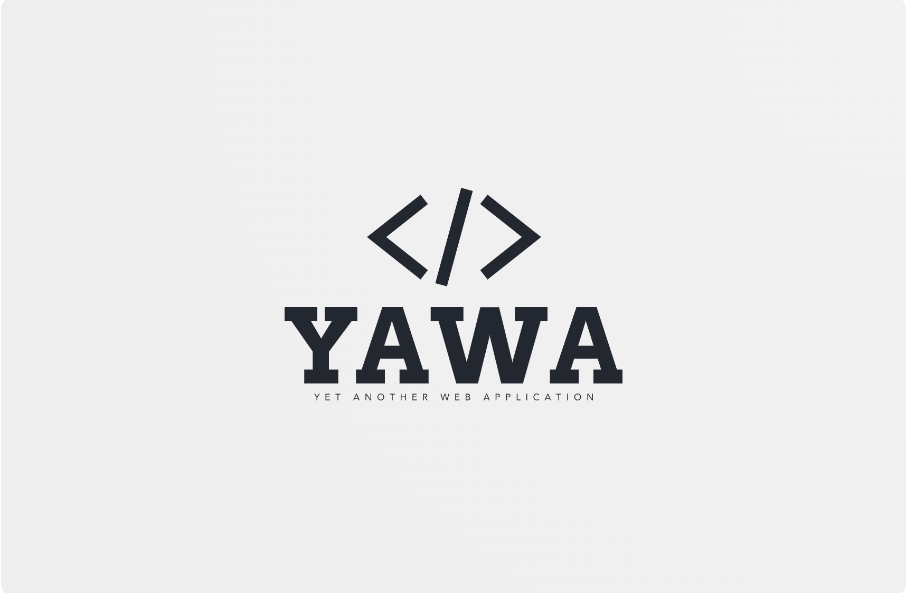

# YAWA



## Requirements
* Configure the local development environment

```shell
make setup
```

* Start Docker

## Quick Start

Build containers
```shell
make build

# Or a specific container
make build container=[frontend|server|database|dbadmin|grafana|loki|prometheus]
```

Run containers
```shell
make run

# Or a specific container
make run container=[frontend|server|database|dbadmin|grafana|loki|prometheus]
```

Describe containers
```shell
make describe
```

Login to a container
```shell
make login container=[frontend|server|database|dbadmin|grafana|loki|prometheus]
```

Cleanup everything (containers, images, volumes)
```shell
make clean
```

## Containers
The application is made of the containers below.

| Name | Url | Documentation |
|-|-|-|
| frontend   | https://localhost:8010 | [README](frontend/README.md) |
| server     | https://localhost:8002 | [README](server/README.md) |
| database   | https://localhost:3307 | [README](database/README.md) |
| dbadmin    | https://localhost:8003 | [README](database/README.md) |
| grafana    | http://localhost:8005  | [README](grafana/README.md) |
| prometheus | http://localhost:8004  | [README](prometheus/README.md) |

## References
1. [Spring Boot Reference](https://docs.spring.io/spring-boot/docs/2.7.8/reference/html/)
1. [Spring Boot API Docs](https://docs.spring.io/spring-boot/docs/2.7.8/api/)
1. [Spring Gradle Plugin](https://docs.spring.io/spring-boot/docs/current/gradle-plugin/reference/htmlsingle/)
